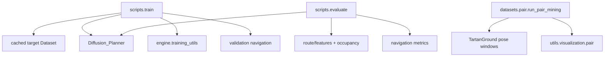

# 整体架构

仓库保留一个模型训练入口、一个模型评估入口和一个独立 pair mining 工具。训练与评估使用完整 `Diffusion_Planner`；pair mining 只从 pose 数据生成候选窗口，不是模型训练依赖。

## 目录职责

```text
configs/dataset/       pair 参数与 TartanGround robot limits
datasets/              cached target Dataset、preprocessing、route、TartanGround features/pose、pair mining
 models/                Diffusion Planner encoder、decoder、DiT、采样与 SDE
 engine/training_utils.py  checkpoint 加载/保存、diffusion loss、验证
 evaluation/            fixed-goal 导航、碰撞几何与导航指标
 scripts/               train.py、evaluate.py
 utils/                 config、I/O、normalizer、pair visualization
 tests/                 保留的 core、model/data/route 与 navigation checks
 docs/                  分层说明与按实验整理的记录
```

## 调用关系



## 保留边界

- `scripts/train.py` 和 `scripts/evaluate.py` 是唯一模型训练与评估 CLI。
- `engine/training_utils.py` 仅承担 checkpoint publish/load、diffusion loss 和 validation 共用逻辑。
- `models/` 中的 Diffusion Planner 网络实现保持不变；当前训练和评估不构造额外 wrapper。
- 配对窗口构建是独立数据准备路径，不被 train/evaluate 调用，也不代表仓库含 paired model training。

每页维护一个主题；通用数据和输出路径见[07 实验与资源](07_experiments.md)，[1_全量微调复现记录](experiments/1_全量微调复现.md)保存该次实验的固定协议、历史结果和运行状态。
